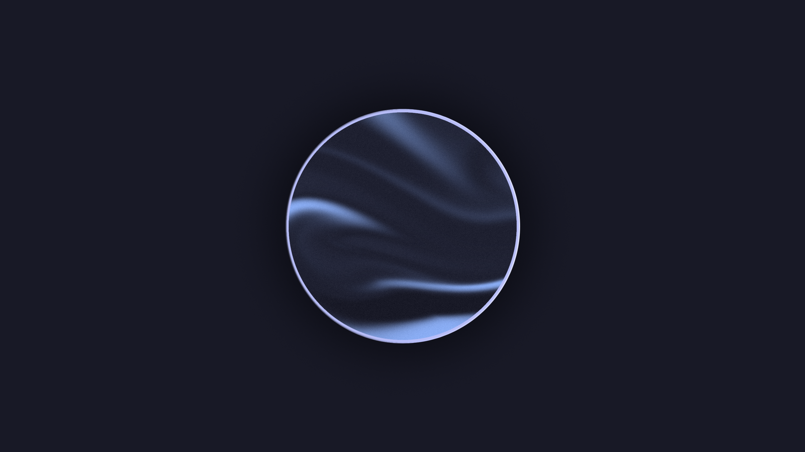

# Dotfiles Repository

-   Welcome to my dotfiles repository! This repository contains configuration files and scripts to set up and manage my development environment.
-   The colorscheme is based on <a href="https://catppuccin.com/palette"> Catppuccin Macchiato </a>

## Waybar:

  
  
 
    
  

## Wallpaper:

    

## Alacritty + FastFetch

    

